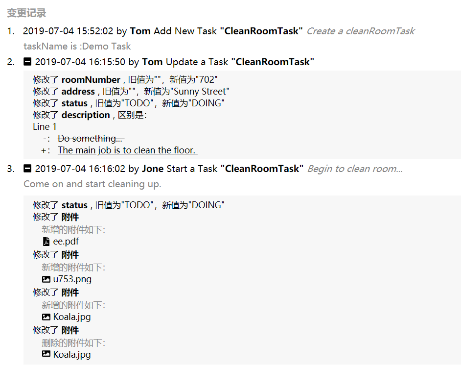

 
## react-object-logger

这是一个对象属性变更历史展示的组件



# 配合使用
该组件配合对象日志变更工具[ObjectLogger](https://github.com/yeecode/ObjectLogger)使用，用以展示对象的变更日志。

# 如何使用
1、下载组件  
`npm install react-object-logger`   
2、应用组件  
`import ObjectLogger from 'react-object-logger';`    
`import 'react-object-logger/lib/css/styles.css';`    
3、使用  
`<ObjectLogger logList={this.logList}></ObjectLogger>`  
注意：  
`this.logList`格式及具体字段含义请参考[ObjectLogger](https://github.com/yeecode/ObjectLogger)：  
也可以在本项目示例文件夹下进行对照参考：https://github.com/promise-coding/react-object-logger/tree/master/example/src   

附：
logList数据样例  
```
[
    {
        "id": 4,
        "appName": "ObjectLoggerDemo",
        "objectName": "CleanRoomTask",
        "objectId": 5,
        "operator": "Tom",
        "operationName": "add",
        "operationAlias": "Add New Task",
        "extraWords": "Create a cleanRoomTask",
        "comment": "taskName is :Demo Task",
        "operationTime": "2019-07-04T07:52:02.000+0000",
        "attributeModelList": []
    },
    {
        "id": 9,
        "appName": "ObjectLoggerDemo",
        "objectName": "CleanRoomTask",
        "objectId": 5,
        "operator": "Tom",
        "operationName": "update",
        "operationAlias": "Update a Task",
        "extraWords": null,
        "comment": null,
        "operationTime": "2019-07-04T08:15:50.000+0000",
        "attributeModelList": [
            {
                "attributeType": "NORMAL",
                "attributeName": "roomNumber",
                "attributeAlias": "roomNumber",
                "oldValue": "",
                "newValue": "702",
                "diffValue": null,
                "id": 11,
                "operationId": 9
            },
            {
                "attributeType": "NORMAL",
                "attributeName": "address",
                "attributeAlias": "address",
                "oldValue": "",
                "newValue": "Sunny Street",
                "diffValue": null,
                "id": 12,
                "operationId": 9
            },
            {
                "attributeType": "NORMAL",
                "attributeName": "status",
                "attributeAlias": "Status",
                "oldValue": "TODO",
                "newValue": "DOING",
                "diffValue": null,
                "id": 13,
                "operationId": 9
            },
            {
                "attributeType": "TEXT",
                "attributeName": "description",
                "attributeAlias": "Description",
                "oldValue": "Do something...",
                "newValue": "The main job is to clean the floor.",
                "diffValue": "Line 1<br/>&nbsp;&nbsp;&nbsp; -： <del> Do something... </del> <br/>&nbsp;&nbsp; +： <u> The main job is to clean the floor. </u> <br/>",
                "id": 14,
                "operationId": 9
            }
        ]
    },
    {
        "id": 11,
        "appName": "ObjectLoggerDemo",
        "objectName": "CleanRoomTask",
        "objectId": 5,
        "operator": "Jone",
        "operationName": "start",
        "operationAlias": "Start a Task",
        "extraWords": "Begin to clean room...",
        "comment": "Come on and start cleaning up.",
        "operationTime": "2019-07-04T08:16:02.000+0000",
        "attributeModelList": [
            {
                "attributeType": "NORMAL",
                "attributeName": "status",
                "attributeAlias": "Status",
                "oldValue": "TODO",
                "newValue": "DOING",
                "diffValue": null,
                "id": 15,
                "operationId": 11
            },{
                "id": 1135,
                "actionId": 3761,
                "attributeType": "ATTACHMENT",
                "attribute": "attachment",
                "attributeName": "附件",
                "oldValue": null,
                "newValue": null,
                "diffValue": {del:[],add:[{belongTo:"ee",belongToStage:"ee",contentType:"application/pdf",fileId:"ee.DAT",fileName:"ee.pdf",fileSize:394411,fileType:"pdf",id:5474,isConfirmed:0,isDeleted:0,outerId:43170,uploadTime:1559788779000}]}
            },{
                "id": 1138,
                "actionId": 3766,
                "attributeType": "ATTACHMENT",
                "attribute": "attachment",
                "attributeName": "附件",
                "oldValue": null,
                "newValue": null,
                "diffValue": {del:[],add:[{belongTo:"ee",belongToStage:"ee",contentType:"image/png",fileId:"ee.DAT",fileName:"u753.png",fileSize:224098,fileType:"png",id:5500,isConfirmed:0,isDeleted:0,outerId:43170,uploadTime:1560330531000}]}
            },{
                "id": 1042,
                "actionId": 3672,
                "attributeType": "ATTACHMENT",
                "attribute": "attachment",
                "attributeName": "附件",
                "oldValue": null,
                "newValue": null,
                "diffValue": {del:[],add:[{belongTo:"ee",belongToStage:"ee",contentType:"image/jpeg",fileId:"ee.DAT",fileName:"Koala.jpg",fileSize:780831,fileType:"jpg",id:5471,isConfirmed:0,isDeleted:0,outerId:43170,uploadTime:1559532908000}]}
            },{
                "id": 1207,
                "actionId": 3965,
                "attributeType": "ATTACHMENT",
                "attribute": "attachment",
                "attributeName": "附件",
                "oldValue": null,
                "newValue": null,
                "diffValue": {del:[{belongTo:"ee",belongToStage:"ee",contentType:"image/jpeg",fileId:"ee.DAT",fileName:"Koala.jpg",fileSize:780831,fileType:"jpg",id:5471,isConfirmed:1,isDeleted:0,outerId:43170,uploadTime:1559532910000}],add:[]}
            }
        ]
    }
]
```