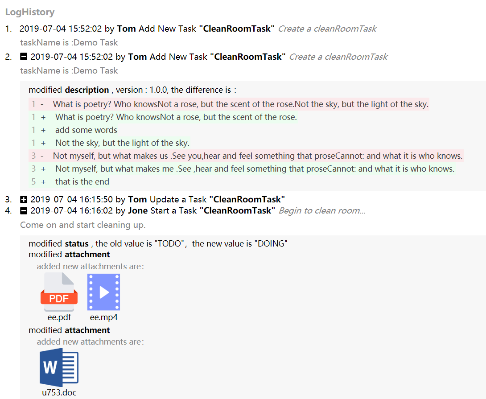

 
## react-object-logger

A react component for listing changed attributes logs of java-object，try the component [demo](https://promise-coding.github.io/react-object-logger/)

Chinese [README.md](https://github.com/promise-coding/react-object-logger/blob/master/README-中文.md)



# Collocation
The component collocates with the object-logger tool [ObjectLogger](https://github.com/yeecode/ObjectLogger)，which used for recording changed object attributes logs.

# How to use
1、download  
`npm install react-object-logger`  
2、import component and style  
`import ObjectLogger from 'react-object-logger';`  
`import 'react-object-logger/lib/css/styles.css';`  
3、demo  
`<ObjectLogger logList={logList} lang="en" title="LogHistory" attachmentStyle="origin" fileUrl="http://localhost:9527/file" />`  
attentions：  
`this.logList` which fields and what a field means please forward to [ObjectLogger](https://github.com/yeecode/ObjectLogger)：
also, you can find the demo sources in this project：(source code path) https://github.com/promise-coding/react-object-logger/tree/master/example/src

# Component props
- `title`：log listing title, the default value is empty string '', you can set any string value yourself；
- `logList`；array type, log contents list；
-  `lang`：log listing language, the default value is English('en'), you also set Chinese('zh')；
-  `fileUrl`：if the logs contain file attachments, you could set `fileUrl` which stored these attachments for showing or downloading; the default value is empty string；
-  `attachmentStyle`: attachments style, the default value is 'origin' which use build-in images for presenting; the other option is 'icon', icon and attachment name are presenting；

# Supplements：  
`logList` fields demo
```
[
    {
        "id": 4,
        "appName": "ObjectLoggerDemo",
        "objectName": "CleanRoomTask",
        "objectId": 5,
        "operator": "Tom",
        "operationName": "add",
        "operationAlias": "Add New Task",
        "extraWords": "Create a cleanRoomTask",
        "comment": "taskName is :Demo Task",
        "operationTime": "2019-07-04T07:52:02.000+0000",
        "attributeModelList": []
    },
    {
        "id": 5,
        "appName": "ObjectLoggerDemo",
        "objectName": "CleanRoomTask",
        "objectId": 5,
        "operator": "Tom",
        "operationName": "add",
        "operationAlias": "Add New Task",
        "extraWords": "Create a cleanRoomTask",
        "comment": "taskName is :Demo Task",
        "operationTime": "2019-07-04T07:52:02.000+0000",
        "attributeModelList": [
            {
                "attributeType": "RICHTEXT",
                "attributeName": "description",
                "attributeAlias": "Description",
                "oldValue": "<p>What is poetry? Who knows<br>Not a rose, but the scent of the rose.<br>Not the sky, but the light of the sky.</p><p><span style=\"font-weight: bold;\">Hi~</span></p><p>Not the fly, but the gleam of the fly.<br>Not the sea, but the sound of sea .</p><p><br></p><p><br>Not myself, but what makes us .<br>See you,hear and feel something that prose<br>Cannot: and what it is who knows.</p><h2>yes!</h2><p><br></p><p><br></p><p>that is the end</p>",
                "newValue": "<p>What is poetry? Who knows<br>Not a rose, but the scent of the rose.<br><p>add some words</p>Not the sky, but the light of the sky.</p><p><span style=\"font-weight: bold;\">Hi~ this is demo</span></p><p>Not the fly, but the gleam of the fly.<br>Not the sea, but the sound of sea .</p><p><br></p><p><br>Not myself, but what makes me .<br>See ,hear and feel something that prose<br>Cannot: and what it is who knows.</p><h2>yes!</h2>",
                "diffValue": "{\"version\":\"1.0.0\",\"content\":[{\"lineNumber\":1,\"partList\":[{\"partType\":\"CHANGE_OLD\",\"partContent\":\"What is poetry? Who knowsNot a rose, but the scent of the rose.Not the sky, but the light of the sky.\"},{\"partType\":\"CHANGE_NEW\",\"partContent\":\"What is poetry? Who knowsNot a rose, but the scent of the rose.\"},{\"partType\":\"CHANGE_NEW\",\"partContent\":\"add some words\"},{\"partType\":\"CHANGE_NEW\",\"partContent\":\"Not the sky, but the light of the sky.\"}]},{\"lineNumber\":3,\"partList\":[{\"partType\":\"CHANGE_OLD\",\"partContent\":\"Not myself, but what makes us .See you,hear and feel something that proseCannot: and what it is who knows.\"},{\"partType\":\"CHANGE_NEW\",\"partContent\":\"Not myself, but what makes me .See ,hear and feel something that proseCannot: and what it is who knows.\"}]},{\"lineNumber\":5,\"partList\":[{\"partType\":\"DEL\",\"partContent\":\"that is the end\"}]}]}",
                "id": 103,
                "operationId": 50
            }
        ]
    },
    {
        "id": 9,
        "appName": "ObjectLoggerDemo",
        "objectName": "CleanRoomTask",
        "objectId": 5,
        "operator": "Tom",
        "operationName": "update",
        "operationAlias": "Update a Task",
        "extraWords": null,
        "comment": null,
        "operationTime": "2019-07-04T08:15:50.000+0000",
        "attributeModelList": [
            {
                "attributeType": "NORMAL",
                "attributeName": "roomNumber",
                "attributeAlias": "roomNumber",
                "oldValue": "",
                "newValue": "702",
                "diffValue": null,
                "id": 11,
                "operationId": 9
            },
            {
                "attributeType": "NORMAL",
                "attributeName": "address",
                "attributeAlias": "address",
                "oldValue": "",
                "newValue": "Sunny Street",
                "diffValue": null,
                "id": 12,
                "operationId": 9
            },
            {
                "attributeType": "NORMAL",
                "attributeName": "status",
                "attributeAlias": "Status",
                "oldValue": "TODO",
                "newValue": "DOING",
                "diffValue": null,
                "id": 13,
                "operationId": 9
            },
            {
                "attributeType": "TEXT",
                "attributeName": "description",
                "attributeAlias": "Description",
                "oldValue": "Do something...",
                "newValue": "The main job is to clean the floor.",
                "diffValue": "Line 1<br/>&nbsp;&nbsp;&nbsp; -： <del> Do something... </del> <br/>&nbsp;&nbsp; +： <u> The main job is to clean the floor. </u> <br/>",
                "id": 14,
                "operationId": 9
            }
        ]
    },
    {
        "id": 11,
        "appName": "ObjectLoggerDemo",
        "objectName": "CleanRoomTask",
        "objectId": 5,
        "operator": "Jone",
        "operationName": "start",
        "operationAlias": "Start a Task",
        "extraWords": "Begin to clean room...",
        "comment": "Come on and start cleaning up.",
        "operationTime": "2019-07-04T08:16:02.000+0000",
        "attributeModelList": [
            {
                "attributeType": "NORMAL",
                "attributeName": "status",
                "attributeAlias": "Status",
                "oldValue": "TODO",
                "newValue": "DOING",
                "diffValue": null,
                "id": 15,
                "operationId": 11
            },{
                "id": 1135,
                "actionId": 3761,
                "attributeType": "ATTACHMENT",
                "attribute": "attachment",
                "attributeName": "attachment",
                "oldValue": null,
                "newValue": null,
                "diffValue": {
                    del:[{belongTo:"ee",belongToStage:"ee",contentType:"audio/mpeg",fileId:"ee.DAT",fileName:"ee.mp3",fileSize:394411,fileType:"mp3",id:5474,isConfirmed:0,isDeleted:0,outerId:43170,uploadTime:1559788779000},
                        {belongTo:"ee",belongToStage:"ee",contentType:"application/zip",fileId:"ee.DAT",fileName:"ee.zip",fileSize:394411,fileType:"zip",id:5474,isConfirmed:0,isDeleted:0,outerId:43170,uploadTime:1559788779000}],
                    add:[{belongTo:"ee",belongToStage:"ee",contentType:"application/pdf",fileId:"ee.DAT",fileName:"ee.pdf",fileSize:394411,fileType:"pdf",id:5474,isConfirmed:0,isDeleted:0,outerId:43170,uploadTime:1559788779000},
                        {belongTo:"ee",belongToStage:"ee",contentType:"video/avi",fileId:"ee.DAT",fileName:"ee.avi",fileSize:394411,fileType:"avi",id:5474,isConfirmed:0,isDeleted:0,outerId:43170,uploadTime:1559788779000}]}
            },{
                "id": 1138,
                "actionId": 3766,
                "attributeType": "ATTACHMENT",
                "attribute": "attachment",
                "attributeName": "attachment",
                "oldValue": null,
                "newValue": null,
                "diffValue": {del:[],add:[{belongTo:"ee",belongToStage:"ee",contentType:"image/png",fileId:"ee.DAT",fileName:"u753.png",fileSize:224098,fileType:"png",id:5500,isConfirmed:0,isDeleted:0,outerId:43170,uploadTime:1560330531000}]}
            },{
                "id": 1042,
                "actionId": 3672,
                "attributeType": "ATTACHMENT",
                "attribute": "attachment",
                "attributeName": "attachment",
                "oldValue": null,
                "newValue": null,
                "diffValue": {del:[],add:[{belongTo:"ee",belongToStage:"ee",contentType:"application/vnd.ms-powerpoint",fileId:"ee.DAT",fileName:"daxiong.ppt",fileSize:780831,fileType:"ppt",id:5471,isConfirmed:0,isDeleted:0,outerId:43170,uploadTime:1559532908000}]}
            },{
                "id": 1207,
                "actionId": 3965,
                "attributeType": "ATTACHMENT",
                "attribute": "attachment",
                "attributeName": "attachment",
                "oldValue": null,
                "newValue": null,
                "diffValue": {del:[{belongTo:"ee",belongToStage:"ee",contentType:"text/plain",fileId:"ee.DAT",fileName:"rich.text",fileSize:780831,fileType:"txt",id:5471,isConfirmed:1,isDeleted:0,outerId:43170,uploadTime:1559532910000}],add:[]}
            }
        ]
    }
]
```
